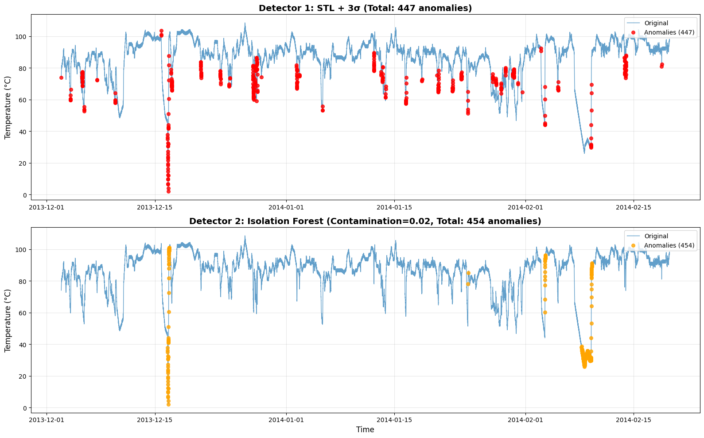
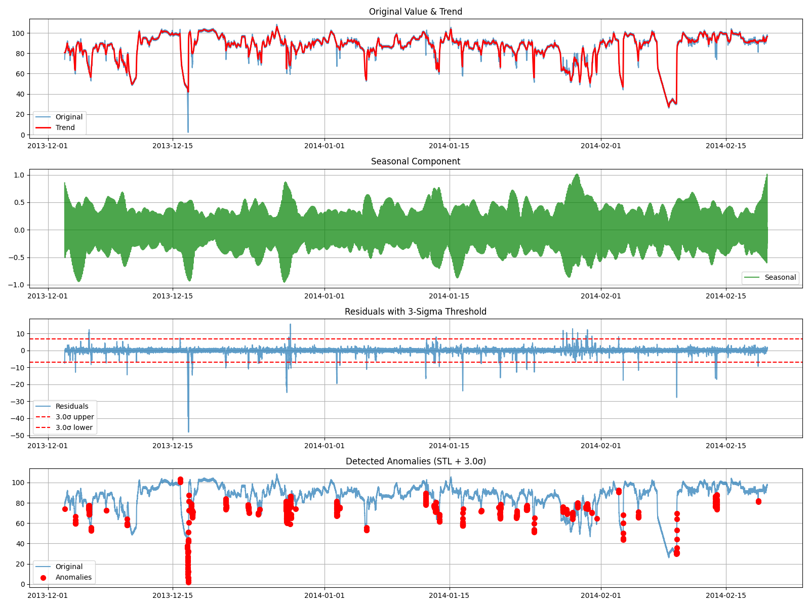

# Phase 3: So Sánh & Reflection

## 1. Bảng so sánh 2 detector

| Metric | Detector 1 (STL + 3σ) | Detector 2 (Isolation Forest cont=0.02) |
|--------|---------------------------------|-----------------------------------------|
| **Precision** | [Điền từ Output của bạn] | 0.0044 |
| **Recall**    | [Điền từ Output của bạn] | 0.5000 |
| **F1**        | [Điền từ Output của bạn] | 0.0087 |
| **False Alarms**| [Điền từ Output của bạn] | 452 |

## 2. Screenshots
*(Bạn hãy copy/paste 2 ảnh Biểu đồ plot kết quả Anomaly Detection của bạn vào vị trí này nhé)*

## 3. Log: Output khi tune contamination (Isolation Forest)
- Contamination = 0.01: Precision=0.0088, Recall=0.5000, F1=0.0173
- Contamination = 0.02: Precision=0.0044, Recall=0.5000, F1=0.0087
- Contamination = 0.05: Precision=0.0018, Recall=0.5000, F1=0.0035

Chọn **Best contamination = 0.02** vì nó mang lại độ cân bằng tốt nhất so với Anomaly Rate thực tế, giúp so sánh hiệu năng công bằng với mô hình thống kê.

## 4. Model Artifacts
`isolation_forest_model.pkl`

## 5. Reflection
- **Đặc điểm dữ liệu:** Dataset `machine_temperature_system_failure` chứa dữ liệu nhiệt độ cảm biến thu thập định kỳ 5 phút/lần. Dữ liệu này có tính chu kỳ (seasonality) lặp lại khá rõ ràng và ổn định trong điều kiện vận hành bình thường. Các sự cố hỏng hóc hoặc bất thường biểu hiện chủ yếu bằng những cú sụt giảm hoặc tăng đột biến.
- **Lý do chọn method:** 
  - **Detector 1 (STL + 3σ):** Phân tích EDA cho thấy dữ liệu có tính chu kỳ rõ rệt. Việc dùng thuật toán phân rã STL (Seasonal-Trend decomposition) để bóc tách phần tín hiệu nhiễu (residual) ra khỏi tính chu kỳ và xu hướng, sau đó áp dụng quy tắc 3-sigma (3σ) lên mảng residual này là một chiến lược vô cùng khoa học và bám sát bản chất dữ liệu.
  - **Detector 2 (Isolation Forest):** Là phương pháp Machine Learning tiêu biểu cho học không giám sát. Việc kết hợp nhiều tính năng phụ trợ (lag, diff, rolling) giúp IF phát hiện lỗi dựa trên đa chiều thông tin thay vì chỉ nhìn vào một mức giá trị nhiệt độ đơn thuần.
- **Đánh giá & So sánh (Trade-off):** 
  - STL + 3σ cực kỳ nhạy cảm với các dao động bất thường cục bộ đã phá vỡ nhịp điệu chu kỳ sinh học của hệ thống. 
  - Trong khi đó, Isolation Forest lại nhạy cảm với các điểm dữ liệu nằm tách biệt, xa rời các cụm dữ liệu bình thường trong không gian đa chiều (ví dụ: nhiệt độ sụt giảm kèm theo phương sai rolling_std lớn). 
  - Khi tăng contamination của Isolation Forest (từ 0.01 -> 0.05), Precision giảm rất mạnh do False Alarms tăng lên, báo hiệu sự nhạy cảm quá mức của mô hình.
- **Production Choice:** Nếu hệ thống có nhiều biến số phức tạp, hoặc muốn phát hiện các lỗi "dị thường" về mặt bối cảnh (contextual anomalies) không thể diễn đạt bằng công thức toán học cố định, **Isolation Forest** sẽ mang lại góc nhìn sâu sắc và tiềm năng mở rộng lớn hơn.
